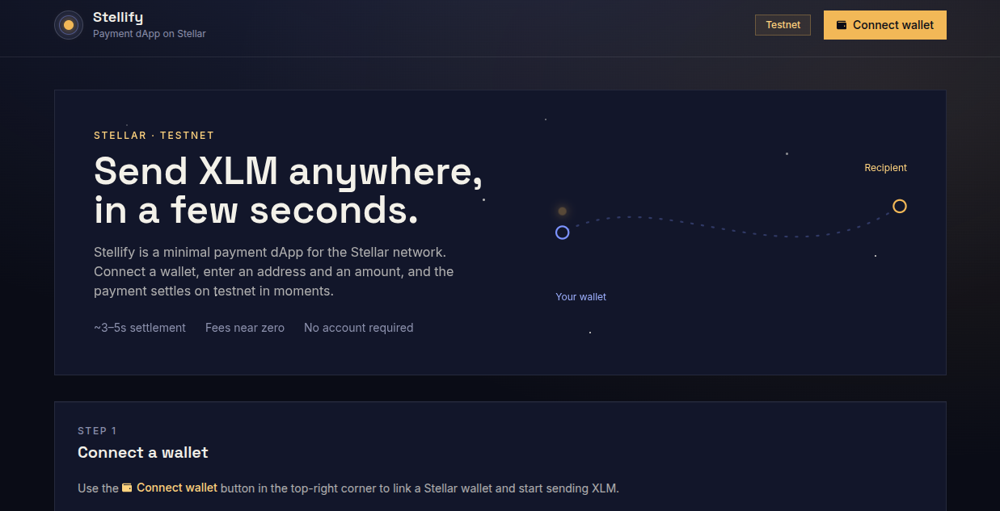

# Stellify

**Live demo:** [https://stellify-dapp.vercel.app/](https://stellify-dapp.vercel.app/)



## About

Stellify is a minimal payment dApp for the Stellar network. Connect any
supported Stellar wallet, view your XLM balance, and send payments to any
address in a few seconds — all on **Stellar Testnet**, so nothing here ever
touches real funds.

Built with **Bun**, **Next.js 14**, **TypeScript**, **Tailwind CSS**, and the
**Stellar SDK** + **Stellar Wallets Kit** (supports Freighter, xBull, Albedo,
Rabet, Lobstr, Hana, and more).

## Features

- Connect any Stellar wallet via Stellar Wallets Kit
- View XLM balance (+ any other assets on the account)
- Send XLM to any address, with an optional memo
- Recent transaction history, with links to Stellar Expert
- All wired to **Testnet** — no real funds are ever touched

## Getting started

Requires [Bun](https://bun.sh) installed.

```bash
# install dependencies
bun install

# start the dev server
bun run dev
```

Open [http://localhost:3000](http://localhost:3000).

### Get testnet XLM

1. Connect your wallet (top of the page)
2. Copy your address
3. Open [Stellar Laboratory](https://laboratory.stellar.org/#account-creator?network=test)
4. Paste your address and click "Fund"
5. Refresh the balance card

## Project structure

```
stellify/
├── app/
│   ├── globals.css       # Theme tokens, base styles, motion-path trail
│   ├── layout.tsx        # Root layout, fonts, metadata
│   └── page.tsx          # Dashboard page
├── components/
│   ├── WalletConnection.tsx
│   ├── WalletConnectButton.tsx
│   ├── BalanceDisplay.tsx
│   ├── PaymentForm.tsx        # Core "send XLM" flow
│   ├── TransactionHistory.tsx
│   └── example-components.tsx # Shared UI primitives (Card, Input, Button…)
├── lib/
│   └── stellar-helper.ts # All blockchain logic (connect, balance, send, history)
└── package.json
```

## Scripts

```bash
bun run dev     # start dev server
bun run build   # production build
bun run start   # run the production build
bun run lint    # lint
```

## Network

This app is hardcoded to **Stellar Testnet** in `lib/stellar-helper.ts`
(`new StellarHelper('testnet')`). Do not send real (mainnet) funds to
addresses shown here.

## Connect with me

- GitHub: [github.com/mishaldotrs](https://github.com/mishaldotrs)
- X (Twitter): [x.com/mishaldotrs](https://x.com/mishaldotrs)
